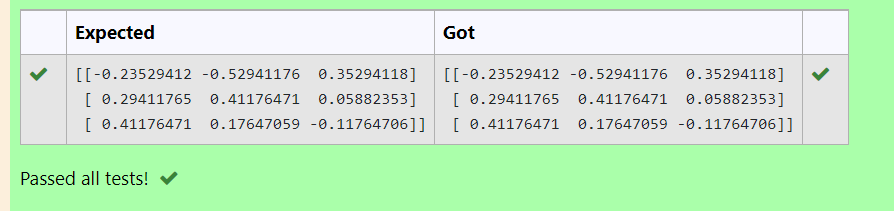

# INVERSE-OF-A-MATRIX
## Aim:
To write a python program to find the inverse of a matrix
## Equipment’s required:
1. 	Hardware – PCs
2. 	Anaconda – Python 3.7 Installation / Moodle-Code Runner
## Algorithm:
### Step1 : 
import numpy as n
### Step 2:
using array function change the equation into a matrix 
### Step 3: 
by using the format of n.linalg.inv() , we can find the inverse of matrix 

## Program:
```
#Program to find the inverse of a matrix.
#Developed by: G DARIO
#RegisterNumber: 22008843

import numpy as n
a=n.array([[1,0,3],[-1,2,-2],[2,3,-1]])
r=n.linalg.inv(a)
print(r)
```
## Output:


## Result:
Thus the inverse of given matrix is successfully solved using python program

